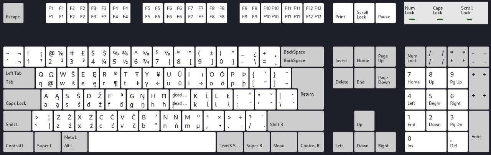

# Polish (Belarusian)
Modified Polish keyboard layout with Belarusian Latin letters for Windows and Linux. This layout slightly differs from Belarusian (Latin) keyboard layout that is present in Linux distributions, mainly due to the need to keep polish `ż` and `ź` letters, therefore belarusian `ž` is moved to `AltGr+d`.

## Preview


## Installation

### Windows:
1. Clone this repository
2. Download Microsoft Keyboard Layout Creator https://www.microsoft.com/en-us/download/details.aspx?id=102134
3. Start Microsoft Keyboard Layout Creator
4. Load Source File `./pl-bel/windows/pl-bel.klc`
5. Run `Project > Build DLL and Setup Package`
6. Skip warnings
7. Go to the build directory and run `setup.exe`

### Linux:
1. Clone this repository
2. Copy symbols file `sudo cp ./pl-bel/linux/plbel /usr/share/X11/xkb/symbols`
3. Copy rules files `sudo cp ./pl-bel/linux/*.{lst,xml} /usr/share/X11/xkb/rules`
3.1 You can also modify rules files on your own, keep in mind that `evdev.xml` and `evdev.lst` should have identical changes with `base.xml` and `base.lst`
To `evdev.lst` and `base.lst` add the following line under `! layout` section:
`plbel           Polish (Belarusian)`
To `evdev.xml` and `base.xml` add the following layout declaration inside `<layoutList></layoutList>` section:
```
    <layout>
      <configItem>
        <name>plbel</name>
        <shortDescription>plbel</shortDescription>
        <description>Polish (Belarusian)</description>
        <languageList>
          <iso639Id>plbel</iso639Id>
        </languageList>
      </configItem>
    </layout>

```
4. Optional: update xkb cache `sudo dpkg-reconfigure xkb-data`


### Both
Windows and Linux requires either a restart or logout for the layout to work properly.

## List of symbols
`AltGr+w` for `š`

`AltGr+u` for `ŭ`

`AltGr+s` for `ś`

`AltGr+d` for `ž`

`AltGr+l` for `ł`

!`AltGr+k` for `ĺ` This works only for Windows as Linux provides grave diacritic only for vowels

`AltGr+x` for `ź`

`AltGr+c` for `ć`

`AltGr+v` for `č`

`AltGr+n` for `ń`

## Thanks
This project is inspired by https://github.com/enedil/lacinka and https://github.com/vtsykun/belarus-keyboard-layout
